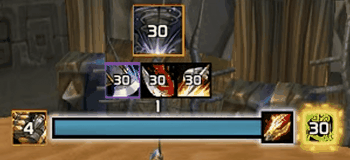
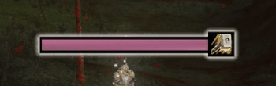
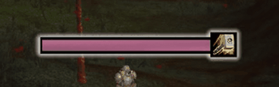
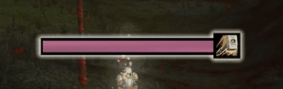

# FruitPlates

**FruitPlates** is a standalone nameplate addon for **World of Warcraft 3.3.5a / WotLK**, built mainly around arena and PvP enviroment.

In arenas, FruitPlates can show **enemy cast bars, buffs, debuffs, and priority auras without requiring you to target that enemy**. The addon uses trusted arena unit paths where available, so important information can stay visible while you play normally.

This project is heavily arena oriented, but also works smoothly in the open world, battlegrounds, duels, cities, and general gameplay.

It focuses on clean visuals, useful information, and performance friendly nameplate handling without relying on awesomewotlk and its APIs.

### **!!! IF YOU CUSTOMIZED YOUR AuraPriorityData.lua MAKE SURE TO BACK IT UP AND COPY IT BACK WITH EACH UPDATE !!!**

---

## Preview

### Nameplates in live arena


### Buffs & debuffs



### Cast bars

<table>
  <tr>
    <td align="center"><strong>Interrupted</strong></td>
    <td align="center"><strong>Do Not Kick</strong></td>
    <td align="center"><strong>Canceled</strong></td>
  </tr>
  <tr>
    <td></td>
    <td></td>
    <td></td>
  </tr>
</table>

### Configuration


---

## Main Features

- Custom enemy, friendly, NPC, and pet nameplates
- Arena focused enemy nameplates
- **Arena cast bars without targeting the enemy**
- **Arena aura tracking without targeting the enemy**
- Enemy and friendly buffs/debuffs
- Aura priority system
- Friendly aura tracking
- Cast bar test mode
- Aura test modes
- Class icons and raid icons
- Target highlight
- Totem handling with clickable totem icons
- Pet handling for arena pets, party/raid pets
- Multiple healthbar textures - only basic ones, will add REAL TEXTURES later
- Fully configurable GUI
- Lightweight runtime behavior

---


## Arena and World Support

FruitPlates was built primarily for **3.3.5a arena gameplay**, where it can use known arena unit tokens such as `arena1-5` and `arenapet1-5` to show enemy cast bars, buffs, debuffs, priority auras, and arena pet information without requiring you to target that enemy.

The addon also works in the open world, battlegrounds, duels, cities, and general gameplay. Enemy players, friendly players, NPCs, pets, totems, and duel targets are supported, but some information is limited by the old 3.3.5a client.

When a unit cannot be reliably identified through arena, party/raid, target, mouseover, or pet tokens, FruitPlates avoids guessing. It is designed to prefer missing information over showing the wrong class, icon, castbar, or aura state on another plate.


---

## Installation

1. Download the latest release.
2. Extract the folder.
3. Place `FruitPlates` into:

```text
World of Warcraft/Interface/AddOns/
```

4. Restart the game or reload your UI.
5. Open the GUI with:

```text
/fp
```

You can also open FruitPlates from:

```text
Interface → AddOns → FruitPlates
```

If you used an older early test build, delete old SavedVariables before testing.

---

## Status

FruitPlates is currently in **beta**.

The addon is stable enough for public testing, but bugs may still exist.

Please report:

- Lua errors
- wrong nameplate identity
- castbars not showing
- aura display issues
- pet/totem weirdness
- frame drops or stutters
- GUI clipping or broken settings

This build still has a lot of debug tools implemented such as:

- /fp debug - toggle debug output
- /fp perf - show performance/debug counters
- /fp rescan - force a nameplate rescan 

---
## SPECIAL BIG THANKS TO

**Asuri** 

for his enormous support and help since early stages of this project. From providing textures, class icons to simply brainstorming and bouncing off ideas and features to implement including testing and feedback. 

Make sure to follow him across all of his platforms! He's an invaluable 3.3.5a creator! 

[](https://www.twitch.tv/AsuriTV) [](https://discord.gg/fkQDxPunG4) [](https://www.youtube.com/@AsuriTV)


**exzu** 

for his help with testing, feedback, ideas and third party source materials to base my project on. Eventhough most of his ideas were: "hey bro can u add this", "hey bro this is dogsh*t" <3
